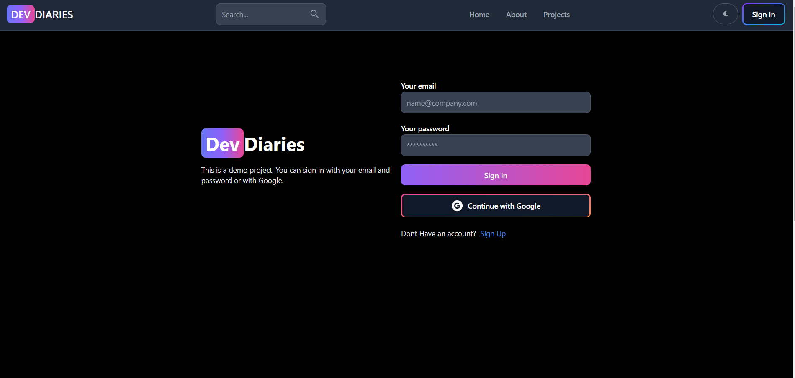
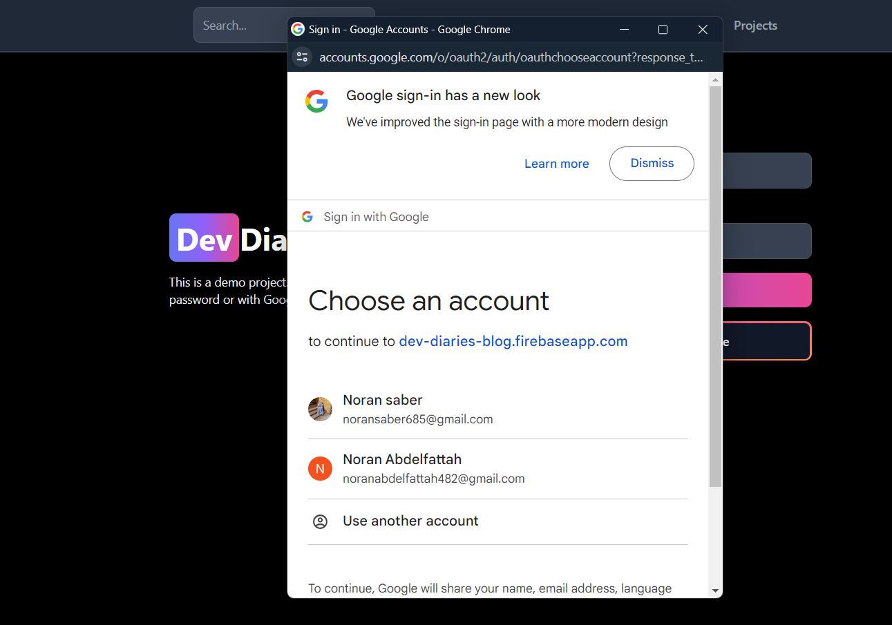
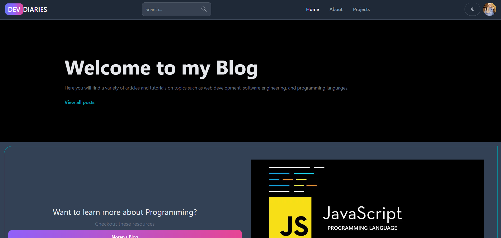
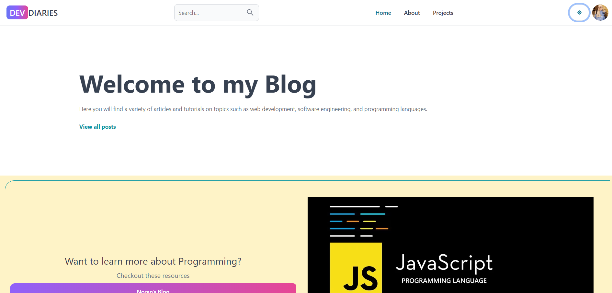
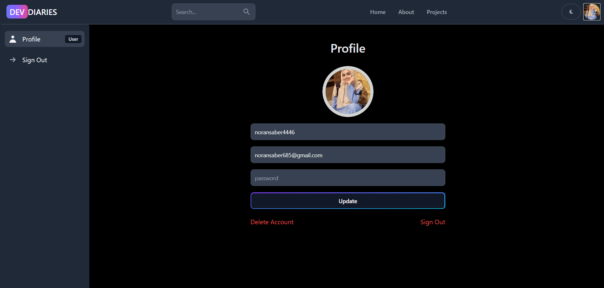
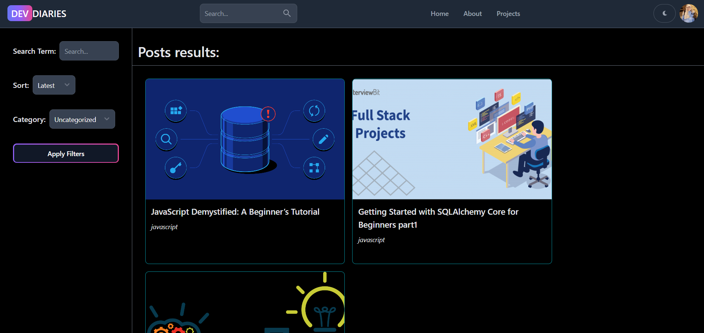

# Dev Diaries

Dev Diaries is a blog platform featuring administrators and users. Administrators have the capability to publish articles, while users are able to view these articles and provide comments.

## Project Description:

Dev Diaries is a blogging platform that includes both administrators and users. Administrators possess the ability to publish articles, as well as edit or delete posts, comments, and user accounts. Users, on the other hand, can view articles, leave comments, and also edit their own comments. Additionally, the platform incorporates Google authentication for user login.

### Envisioned Future Features:

1. Integration of Google Authenticatio
2. Enhanced Authentication Mechanism
3. User-Side Features (Viewing and Commenting)
4. Admin-Side Features (Posting Articles)

## Here are the steps to install and run the project:

1. Copy the project's GitHub link URL.
2. Execute `npm install.`
3. Divide the terminal into two parts.
4. Navigate to the client side in one terminal and to the API side in the other.
5. Run `npm run dev`.
6. Copy the generated link and paste it into your browser.

## How to Use the Project

**Sign in**

**This is the home page**

**Switch between dark or light mode using the button.**

**This represents the profile.**

**You can discover the articles here.**

